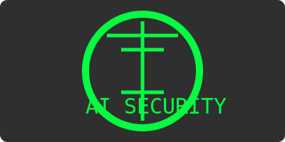

# Awesome AI Security Tools

> A curated list of 200+ AI and machine learning tools for cybersecurity.

## AI Pentesting
- [strix](https://github.com/usestrix/strix) — Autonomous AI pentesting agent (32k stars)
- [CyberStrikeAI](https://github.com/Ed1s0nZ/CyberStrikeAI) — 100+ integrated security tools
- [deepsec](https://github.com/vercel-labs/deepsec) — AI vulnerability scanner

## Malware Analysis
- AI Malware Detector — ML-based classification
- DeepPayload — Deep learning payload analysis
- Neural Sandbox — AI-powered sandboxing

## Threat Intelligence
- MITRE ATLAS — Adversarial threat knowledge base
- OWASP AI Security — LLM security top 10
- NIST AI RMF — AI risk management

## Contributing
PRs welcome! See CONTRIBUTING.md.

## License
[CC0](https://creativecommons.org/publicdomain/zero/1.0/)
